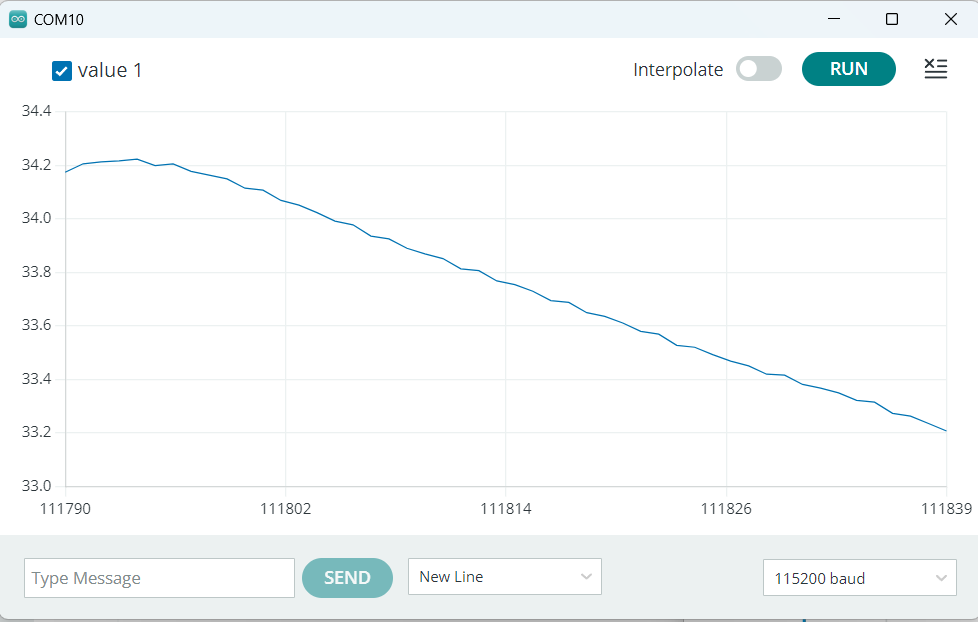
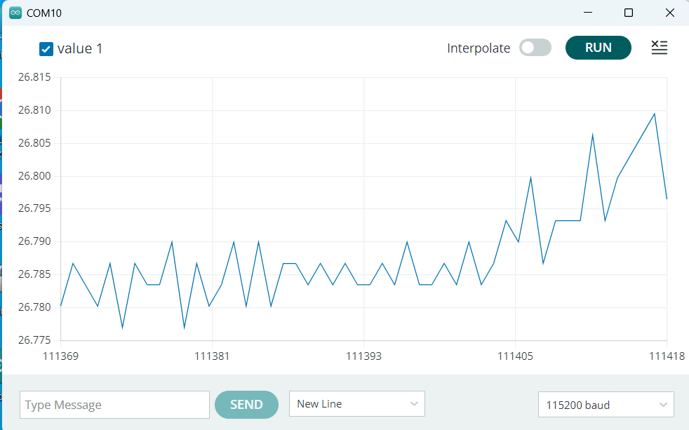
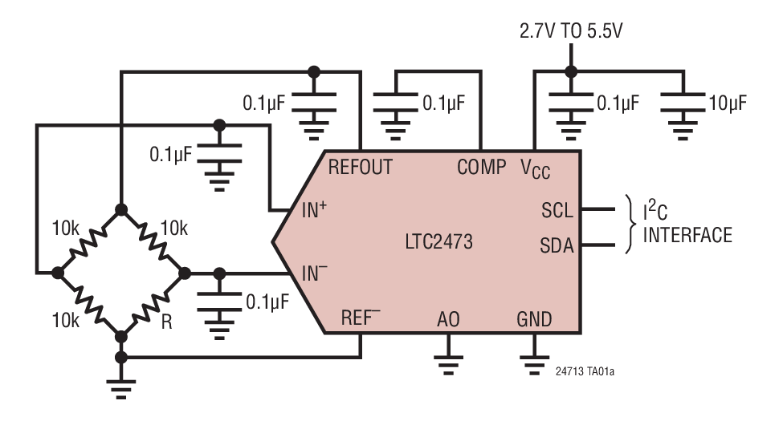
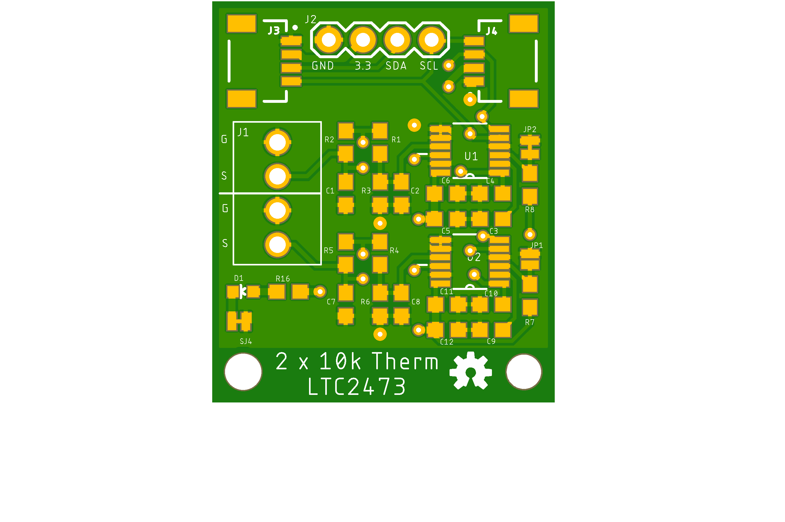
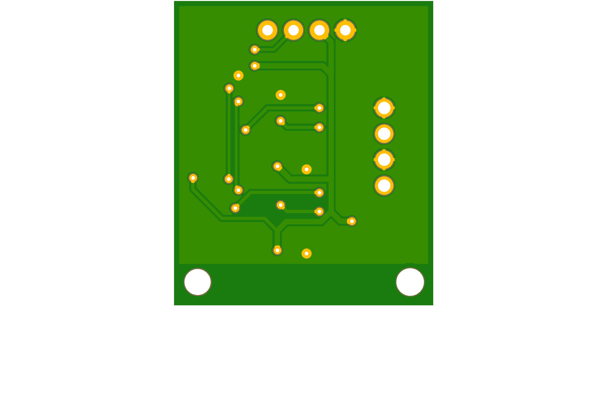

LTC2473 833 Hz 16 bit A/D converter for I2C
===========================================

This project includes the **hardware** and **software** for a small A/D board
that can be connected with QWIIC to any microcontroller or single board
computer. It is ideal to measure **temperature** to less than 0.1 &deg; C accuracy or to record **strain** gauges.





## Hardware

The A/D converter is the Linear Technology [LTC2473](https://www.analog.com/en/products/ltc2473.html).



"The LTC2473 is a small, **16-bit** analog-to-digital converter with an
integrated precision reference and a selectable **208sps** or **833sps** output
rate. It uses a single 2.7V to 5.5V supply and communicates through an I2C
Interface at 100 or 400 kbit/sec. 
The LTC2473 is differential with a +-VREF input range.
The ADC includes a 1.25V integrated reference with 2ppm/C drift performance 
and 0.1% initial accuracy. It includes an integrated oscillator and performs
conversions with no latency for multiplexed applications. 
The LTC2473 includes a proprietary input sampling scheme that reduces 
the average input current several orders of magnitude. 
When put in sleep mopde it consumes 0.2microA." (Linear Technology)

A dual channel board was designed with Eagle CAD and fabricated by [JLPCP](https://jlcpcb.com/). Parts were sourced from:

- LCSC for parts in China: https://www.lcsc.com/
- Digikey for parts in USA: https://www.digikey.com/en/products/
- Mouser for parts in USA: https://www.mouser.com/electronic-components/

If you modify the board (hardware folder) and send it for manufacturing I suggest the following steps in Eagle CAD:

- Make sure your board has no errors (Tools->Errors)
- Check on Manufacturing Tab how your board looks like
- CAM Processor -> Local CAM Jobs -> examples -> example_2_layer.cam
    Enable ZIP (this creates Gerber files)
- In schematic run ULP -> Browse for eagle_bom.ulp in this GIT repository -> CSV export and comma separator not semi colon (this creates bill of materials)
- In board run ULP -> Browse for eagle_smt.ulp (this creates part placement instructions)
- Edit BOM and part placement and adjust it to PCBWay example, choose manufacturers and part numbers, check availability and make sure foot print matches. Save as XLSX. In the part placement file remove the configuration solder pads as they will not need to be populated.
- Upload to your preferred manufacturer

Although the LTC2473 is listed for $3 in bulk, for small quantities, it is much more expensive and LCSC does not have it in stock.

 

## Software

A custom Arduino Library was created and has been tested with an ESP32-S3. [Linduino](https://www.analog.com/en/design-center/evaluation-hardware-and-software/evaluation-development-platforms/linduino.html) was used for reference. Correct register settings and transfer parameters were implemented (The Linduino driver for LTC2473 is likely not working). The software demonstrates that it read 833 samples per second on two converters simultaneously.

This library supports the following functions:
```
available();          // Checks if sensor ack's the I2C request
sleep();              // Put the sensor to sleep
highspeed();          // Set the sensor to high speed mode
regularspeed();       // Set the sensor to low speed mode
read(float *voltage); // Read voltage data from LTC2473
```
It is easy to use:
```
#include <Wire.h>
#include <LTC2473.h>

TwoWire myWire = TwoWire(0);              // Initialize the two wire system.
LTC2473 adc(LTC2473_I2C_ADDRESS_GND);     // Initialize the sensor construct
float voltage = 0.0;
uint8_t error = 0;

void setup() {

  delay(3000);                            // Assure catching setup log
  Serial.begin(115200);
  Serial.println("LTC2473 Demo");

  myWire.begin();                         // Start I2C interface

  adc.begin(myWire);
  if ( adc.available ) { Serial.println("Sensor: set up."); } 
  else                 { Serial.println("Sensor: not present."); }

} // end setup
    
void loop() {
  if (adc.available) {
      error = adc.read(&voltage); 
      if (error == 0) { Serial.printf("Voltage: %.4f\n", voltage); }
      else { Serial.printf("Could not read sensor. Error %d\n", error); } 
  }
  delay(100);
}
```

More advanced example programs are included. Some convert readings to temperature.

Urs Utzinger, 2023
